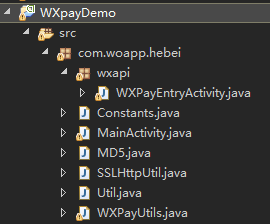

## WXPay notes
1.  准备工作
```
申请微信开发账号，需要填写包名和签名，签名用开发平台的apk,在签名过的程序中获得，具体参见微信开发平台
所需要的数据具体如下：
   --申请时填写包名和签名用于微信的认证
   --认证通过后拿到 AppID（认证所要求的参数），AppSecret
   --商户Id（partnerID）去商户平台申请
   --Key 用于下单和生成sign
```
2.  包的结构
		<br/>
	 1. 需要引入微信SDK
     2. 包名下面的wxapi--WXPayEntryActivity是固定写法，用于支付之后的回调，否则无法回调
     3. 测试的时候，得用App正式签名的包，否则无法调起支付
     4. App签名应该与申请AppId所填写的签名一致
3.  调起支付所需参数按Ascll码排序(尽量统一由平台获取)
```
	fianal IWXAPI = msgApi = WXFactory.createWXAPI(context, null);
	msgApi.registerApp("APPID"); // 注册应用到微信
	PayReq request = new PayReq();
	// 平台申请
	request.appid: "wxb4ba3c02aa476xxx",  
	// 后台生成的随机码，微信平台有规范
	request.noncestr: "2a65fc6bf1f9148171ebb352186d115a",
	// 固定参数
	request.package: "Sign=WXPay",
	// 商户id
	request.partnerid: "10000100",
	// 预订单id，平台通过订单信息从微信平台拿
	request.prepayid:"wx20160223103653f51f3e63e90981186990",
	// 时间戳
	request.timestamp: "1456195013",
	// 数据签名，按微信平台规范
	request.sign: "CF016476883C9BBC4372EC02DEF01D5B"
   成功调起微信支付窗口，返回值0：成功/-1：失败/-2：用户取消

```
### 微信分享：
```
	private IWXAPI apii = WXAPIFactory.createWXAPI(MainActivity.this, Constants.APP_ID);
	
	WXTextObject textObject = new WXTextObject();
	textObject.text = "Hello~";
	
	WXMediaMessage msg = new WXMediaMessage();
	msg.mediaObject = textObject;
	msg.description = "say hi";
	
	// 构造一个Req
	SendMessageToWX.Req req = new SendMessageToWX.Req();
	req.transaction = buildTransaction("text"); // transaction字段用于唯一标识一个请求
	req.message = msg;
	req.scene = SendMessageToWX.Req.WXSceneSession;
	// req.openId = Constants.APP_ID; // 这个参数不用了
	// 调用api接口发送数据到微信
	apii.sendReq(req);
	finish();
	
```
### 微信登陆：
```
	final SendAuth.Req req = new SendAuth.Req();
	req.scope = "snsapi_userinfo"; // 获取用户个人信息
	req.state = "hi there~";
	apii.sendReq(req);

```
